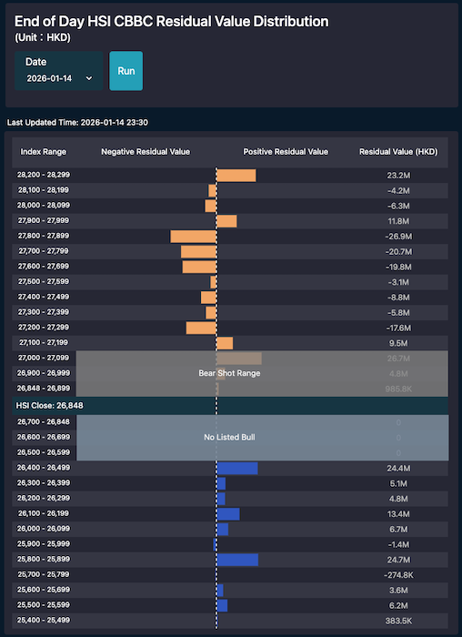

# Django Web Application for HSI CBBC Residual Value

A Django-based web application that provides **end-of-day Hang Seng Index (HSI) CBBC residual value distribution data**, designed to showcase real-world backend engineering practices using Django.

This repository contains a **clean-room rewrite and feature extraction** from a previously deployed production system (**shoot-down.site**), rewritten with a focus on **clean architecture, maintainability, and modern Django best practices**.

The original production system, **shoot-down.site**, was **designed, implemented, and deployed by me** as a live financial data service for the Hong Kong market.

The purpose of this project is to **demonstrate engineering skills**, not to fully replicate the original commercial product.

🔗 **Live demo (this repository):** https://shootdown-django.com  
🔗 **Original production site (built by me):** https://shoot-down.site

---

## What This Project Demonstrates

- Translating real-world financial requirements into backend system design
- Refactoring production logic into a clean, modular Django architecture
- Applying Django best practices and maintainable project structure
- Designing RESTful APIs using Django REST Framework
- Secure authentication and authorization patterns
- Relational database modeling and schema migrations
- Deployment and operation on Ubuntu-based servers
- Writing clean, maintainable Python and JavaScript code
- Proper Git usage and version control workflows

---

## Project Background

The original production system, **shoot-down.site**, was **designed, implemented, and deployed by me** as a live financial data service for the Hong Kong market.

It provided:
- Real-time and end-of-day CBBC (Callable Bull/Bear Contract) data
- Live HSI CBBC tracking
- End-of-day index and stock CBBC residual value calculations
- User authentication and subscription-based access
- Stripe payment integration
- Abuse prevention mechanisms (rate limiting, multi-device access control)

This repository represents a **selective rewrite of the end-of-day HSI CBBC residual value distribution feature**, extracted and refactored to showcase backend engineering practices in Django.

---

## Demo

The application provides an interactive visualization of **end-of-day HSI CBBC residual value distributions** by strike price.

Key UI capabilities:
- Automatic loading of the most recent trading day’s data
- Date picker for historical data exploration
- Custom chart highlighting positive and negative residual values
- Clear visual separation of no-call and call regions

---

## Features (This Repository)

- End-of-day HSI CBBC residual value data visualization
- Date-based historical data selection
- REST API powered by Django REST Framework
- Responsive user interface
- Efficient querying and data handling

---

## Application Behavior

The application displays **end-of-day HSI CBBC residual value distributions** for selected trading dates.

- The most recent available data loads automatically on page entry
- Users can select previous dates to view historical results
- The chart design is custom-built to reflect CBBC characteristics:
  - Different strike prices
  - Positive and negative residual values
  - Clear visual differentiation for financial interpretation

---

### Chart Characteristics

The visualization uses a custom design to clearly present:
- Strike prices along one axis
- Residual values (positive for in-the-money direction, negative otherwise)
- Distribution density across different price levels

The overall appearance resembles a histogram or bar chart centered around the index level, with clear visual cues for bull and bear implications.

---

## Tech Stack

### Backend
- Python
- Django
- Django REST Framework

### Frontend
- JavaScript
- HTML5
- CSS3
- Bootstrap

### Database
- PostgreSQL

---

## Future Improvements

- Improve UI/UX and data visualization
- Expand automated test coverage
- Introduce background task processing for data pipelines
- Enhance authentication and authorization flows
- Reintroduce subscription and payment features

---

## About Me

I am a **full-stack developer** with experience building and maintaining real-world Django applications, currently seeking **junior to mid-level roles**.

- 📧 Email: cmwhknz@gmail.com
